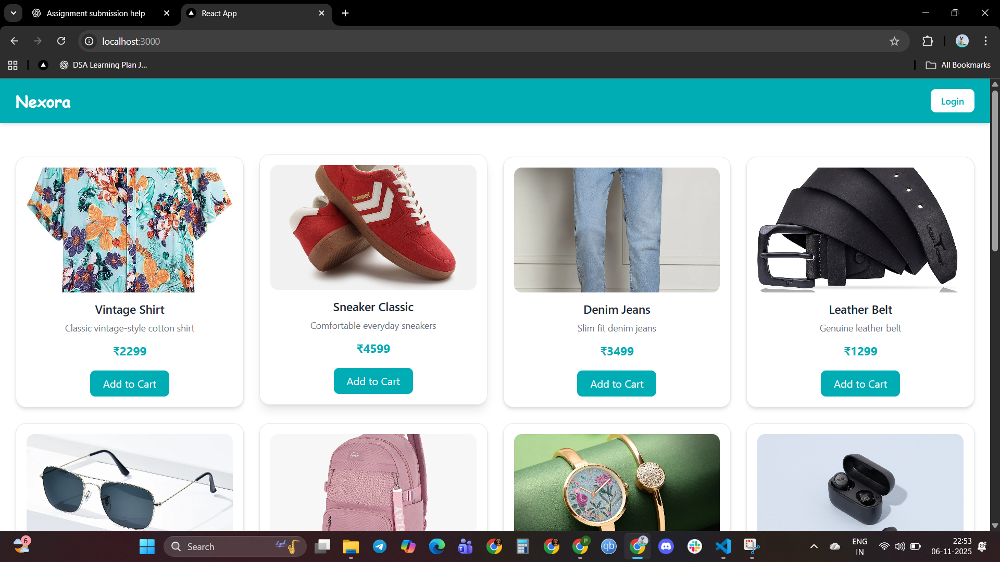
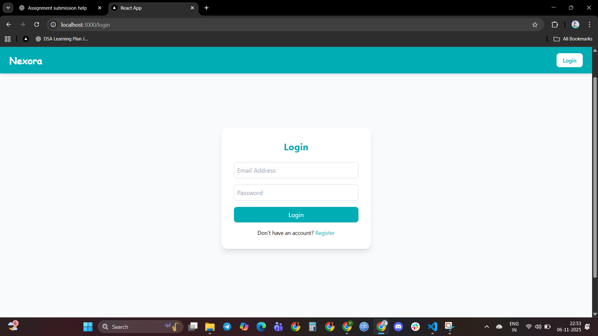
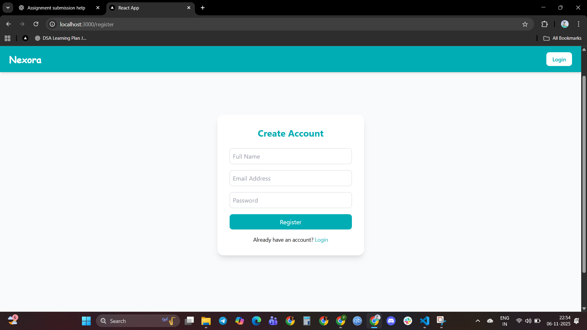
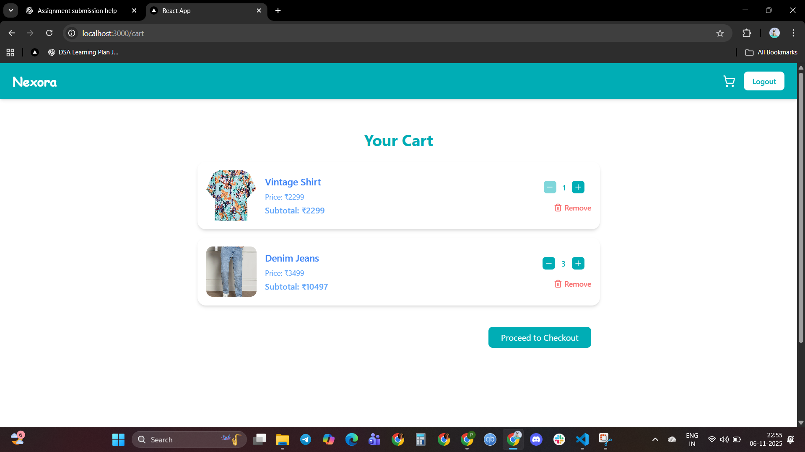

# 🛍️ Nexora — Mock E-Commerce Cart

## 📖 Overview
**Nexora** is a fullstack shopping cart application built as part of the **Vibe Commerce Internship Full Stack Assignment**.  
It demonstrates a complete e-commerce flow — from product listing and cart management to a mock checkout — built using the **MERN (MongoDB, Express, React, Node.js)** stack.

The project showcases frontend–backend integration, RESTful API communication, responsive UI design, and basic data persistence with MongoDB.

---


## 🛠️ Tech Stack
| Layer | Technologies Used |
|--------|------------------|
| **Frontend** | React, Tailwind CSS |
| **Backend** | Node.js, Express.js |
| **Database** | MongoDB |
| **Authentication** | JWT (for learning/demo use) |

---

## ⚙️ Installation & Setup

### Step 1 — Clone the Repository
```bash
git clone https://github.com/kuruvapavani/nexora.git
````

### Step 2 — Backend Setup

```bash
cd backend
npm install
npm run dev
```

### Step 3 — Frontend Setup (in another terminal)

```bash
cd frontend
npm install
npm start
```

---

## 🔑 Environment Variables

### Backend (`/backend/.env`)

```env
MONGODB_URI=<Your MongoDB connection string>
JWT_SECRET=<Your JWT secret>
PORT=<Backend Port>
FRONTEND_URL=<Frontend URL>
```

### Frontend (`/frontend/.env`)

```env
REACT_APP_BASE_URL=<Backend Base URL>
```

---

## 🎥 Demo

### ▶️ Demo Video

[https://github.com/kuruvapavani/nexora/blob/main/assets/videos/demo.mp4](https://github.com/kuruvapavani/nexora/blob/main/assets/videos/demo.mp4)
*(Click to view or download the demo video.)*

---

## 🖼️ Screenshots

#### 🏠 Home Page



#### 🔑 Login Page



#### 📝 Register Page



#### 🛒 Cart Page



#### 💳 Checkout Page


---

## 📂 Project Structure

```
nexora/
├── backend/
│   ├── server.js
│   ├── routes/
│   ├── controllers/
│   ├── models/
│   ├── config/
│   └── .env
├── frontend/
│   ├── src/
│   ├── components/
│   ├── pages/
│   ├── App.js
│   └── .env
├── assets/
│   ├── screenshots/
│   │   ├── home.png
│   │   ├── login.png
│   │   ├── register.png
│   │   ├── cart.png
│   │   └── checkout.png
│   └── videos/
│       └── demo.mp4
└── README.md
```

---

## ⚠️ Disclaimer

This project is created **solely for assignment and learning purposes**.
All assets (images, icons, etc.) are **royalty-free**, sourced from **Unsplash** and **Pexels**.

---

## 👩‍💻 Author

**Kuruva Pavani**
Fullstack Intern Candidate

---

